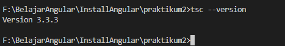
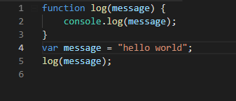
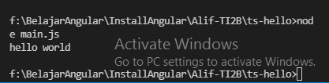

# Jobsheet 2 - TypeScript

### Praktikum – Bagian 1: Instalasi Typescript

Cara mengistal **typescript** dengan perintah berikut `npm install -g typescript`


Cek version dari typescript yang terinstall `tsc --version`


- Membuat folder **ts-hello** menggunakan `mkdir ts-hello`
- Tulisakan file **main.ts** dengan code berikut:

```typescript
function log(message) {
    console.log(message);
}

let message = "Hello World";

log(message);
```

- Kemudian ketik perintah `tsc main.ts` untuk melakukan transpile file **typescript** kedalam **javascript**


-hasil dari typescript pada gambar 3 adalah sebagai berikut:


Cek apakah sudah terbuat file **main.js**, lakukan perintah `ls`


### Praktikum – Bagian 2: Declaring Variables
- Buka file **main.ts**, kemudian tulis code berikut:
```typescript
function doSomething(){
    for (let i = 0; i < 5; i++){
        console.log(i);
    }
    console.log('Finally: ' + i);
}
doSomething();
```

### Praktikum - Bagian 3: Types
- Buka file **main.ts**, kemudian tuliskan listing program berikut:
```typescript
let count =5;
count = 'a';
```

- Soal 9
Lakukan proses transpile file **main.ts** dengan perintah `tsc main.ts` 


- Hasil transpile file **main.ts**, menghasilkan file **main.js** seperti beriku:
```typescript
var count = 5;
count = 'a'; 
```

### Praktikum – Bagian 4: Type Assertion

- Buka file **main.ts**, kemudian tuliskan code berikut:
```typescript
let pesan;
pesan='abc';
let percobaan=(<string>pesan).endsWith('c');
let alternative=(pesan as string).endsWith('c');```

- Soal 10
Remove file **main.js** sebelumnya, lalu Lakukan proses transpile file **main.ts** dengan perintah `tsc main.ts`. Hasil file **main.js**
```typescript
var pesan;
pesan = 'abc';
var percobaan = pesan.endsWith('c');
var alternative = pesan.endsWith('c');
```

### Praktikum – Bagian 5: Arrow Function

- Buka file **main.ts**, kemudian tuliskan code berikut:

```typescript
let log = function pesan(){
    console.log();
}

//kode diatas bisa disingkat menggunakan fungsi arrow
let doLog=(pesan)=>{
    console.log(pesan);
}

//atau seperti berikut
let doLog1=(pesan)=>console.log(pesan);```

- Soal 11
Remove file **main.js** sebelumnya, lalu Lakukan proses transpile file **main.ts** dengan perintah `tsc main.ts`. Hasil file **main.js**
```typescript
var log = function pesan() {
    console.log();
};
//kode diatas bisa disingkat menggunakan fungsi arrow
var doLog = function (pesan) {
    console.log(pesan);
};
//atau seperti berikut
var doLog1 = function (pesan) { return console.log(pesan); };
```
### Praktikum – Bagian 6: Interface

- Buka file **main.ts**, kemudian tuliskan code berikut:

```typescript
interface Point{
    x:number;
    y:number;
}

let drawPoint=(point:Point)=>{
    //...
}

drawPoint({
    x:1,
    y:3,
})
```

- Soal 12
Remove file **main.js** sebelumnya, lalu Lakukan proses transpile file **main.ts** dengan perintah `tsc main.ts`. Hasil file **main.js**
```typescript
var drawPoint = function (point) {
    //...
};
drawPoint({
    x: 1,
    y: 3
});
```

### Praktikum – Bagian 7: Classes

- Buka file **main.ts**, kemudian tuliskan code berikut:
```typescript
class Pointku{
    a:number;
    b:number;

    draw(){
        //...
    }

    getDistance(another:Pointku){
        //...
    }
}
```
- Soal 13
Remove file **main.js** sebelumnya, lalu Lakukan proses transpile file **main.ts** dengan perintah `tsc main.ts`

### Praktikum – Bagian 8: Objects

- Buka file **main.ts**, kemudian tuliskan code berikut:
```typescript
class Pointku{
    a:number;
    b:number;

    draw(){
        console.log('X' + this.a + ',Y' + this.b);
    }

    getDistance(another:Pointku){
        //...
    }
}
```

- Soal 14
Remove file **main.js** sebelumnya, lalu Lakukan proses transpile file **main.ts** dengan perintah `tsc main.ts`